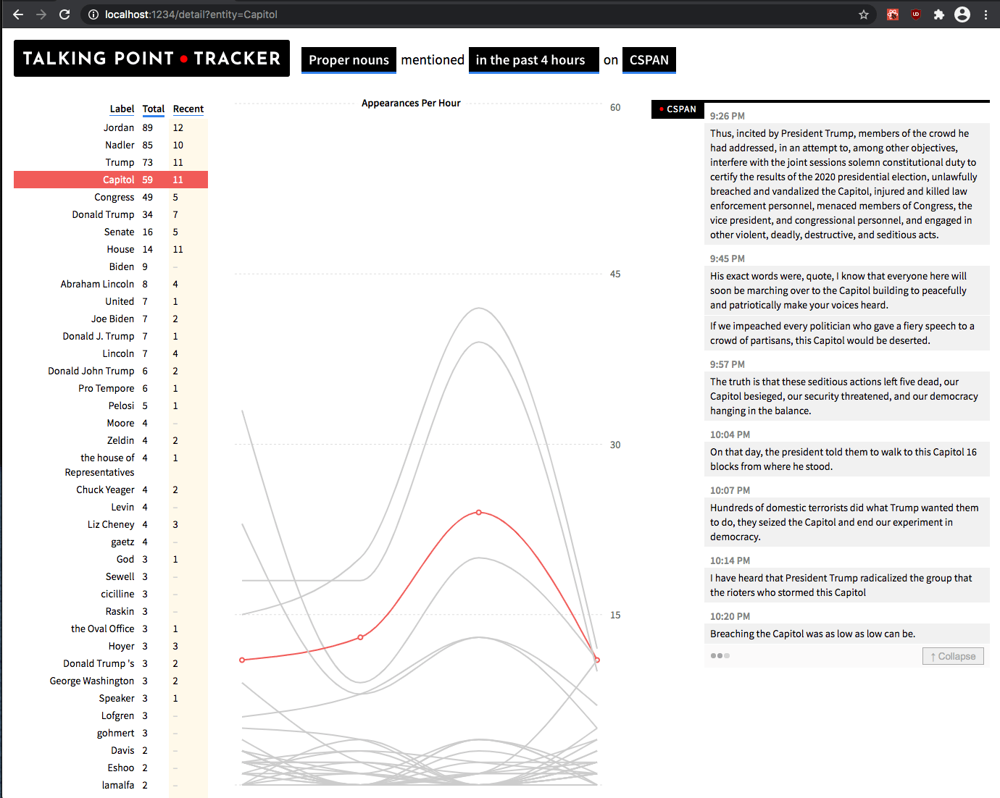

# Talking Point Tracker

Bad Idea Factory is proud to present the talking point tracker, a tool that watches the content of news television and attempts to figure out the zeitgeist of a given segment of time.

This project leverages [Opened Captions](https://github.com/slifty/opened-captions), a project that exposes TV captions in real time for programmers to use in non-consumptive applications.

---

## [*100ideas's very hacky fork*](https://github.com/100ideas/talking-point-tracker)

This year I've found myself wishing I had easy access to full transcripts of congressional hearings and speeches, realistically via scraping and parsing some closed captioning feed somewhere (c-span). I want to be able to search, skim, and also automatically clean, typeset and markup the transcripts so they are easy to share on social media in normal page-sized screenshots.

I found this interesting project and tried to fire 'er up on a lark. I got it working in this fork, although I had to change minor versions of a few deps to make it all work with older node (11 lts).

Also merged in a PR from the original repo that introduced experimental graph rendering and took a quick shot at fixing missing `sentence_id`s caused by postgres/sequelize/graphql/apollo crap that I honestly didn't want to get too deep into. So the demo work, after installing spacey.

**todo**
- drop a line in the main repo to say hello to the original devs
- maybe dockerize everything, and switch to sqlite3 for simplicty
- json and pdf serialization of a given transcript
- integrate with other scrapers to allow for arbitrary fetching of transcripts from c-span
- perhaps add `webvdd` package to consume the `srt` or `vdd` subtitle/caption files `youtube-dl` can fetch from youtube

---

## Technologies

This project requires Python 3 and node.  The project is written in node, but the NLP magic is all from the spaCy project (which is python).

## Installation and setup

See [INSTALL.md](docs/INSTALL.md).

## Tech Stack

- ESLint and Babel for making sure that strangers don't judge use
- GraphQL + Sequelize + Postgresql for storing and exposing our deepest secrets
- React + Express for helping us overcomplicate our interfaces

I feel like I'm forgetting something.

## Directory structure

This project is modeled after our [Truth Goggles](https://github.com/BadIdeaFactory/truthgoggles) project in structure.  Here is an overview of the main directories:

- `/config` contains configurations that go beyond the kinds of simple values that would normally be put inside of `.env`
- `/docs` contains project documentation, mostly for use by human beings who want to contribute to the project or otherwise understand our diabolical plans for the future.
- `/src` contains the actual code.
- `/src/server` contains code that runs on the server.  This includes APIs, worker scripts, models, data, and logic for how to present things to the user.  It basically contains everything that doesn't get loaded into a browser.  There are subdirectories in here but when I started listing out what they were for I realized I was just repeating the names of the folders in my descriptions (e.g. `migrations` `models` `schema` etc.)
- `/src/client` contains code and content related to the user experience.  This is where react and it's fellow demons get written, and ultimately compiled from.
- `/src/client/public` contains static files.  This is where things get compiled to, and is the only directory that the server code actually serves.

## How to contribute

Please consider helping out!  You can see a list of our [issues](https://github.com/badideafactory/talking-point-tracker/issues) and reach out there.  We also have [a website](https://biffud.com) which you can use to get in touch with the project maintainers and join our community.

Be sure to take a look at our [contribution guidelines](CONTRIBUTING.md) as well.
